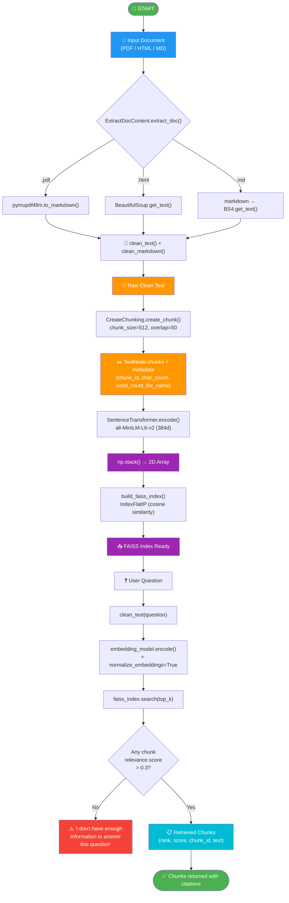

# Cost-Efficient RAG Application — FAISS

A working Retrieval-Augmented Generation (RAG) pipeline over PDF/HTML/MD documents, backed by **FAISS** (free, in-memory vector store), with honest evaluation of retrieval quality, answer quality, latency, and cost.

---

## 1.1 Architecture Diagram / Flowchart

Full path: ingestion (PDF/HTML/MD) → chunking (512 tokens, 50 overlap) → embedding (all-MiniLM-L6-v2, 384d) → FAISS IndexFlatIP → top-k retrieval → grounded answer with citations.



Full version with component table + dependency tree: [`RagPipeline/rag_pipeline_flowchart.md`](RagPipeline/rag_pipeline_flowchart.md)

---

## 1.2 Setup & Run Instructions

### Prerequisites
| Requirement | Value |
|---|---|
| **Python** | 3.10+ |
| **OS** | Linux / macOS / WSL2 |
| **RAM** | 4 GB minimum (8 GB recommended) |
| **Disk** | 2 GB free (for model downloads) |
| **GPU** | Not required — CPU-only mode works |
| **Services** | None — fully local, no API keys |

### Environment Variables
```
RAG_DOC_PATH         # Path to PDF/HTML/MD document
RAG_TOP_K            # Number of chunks to retrieve (default: 10)
RAG_CHUNK_SIZE       # Chunk size in tokens (default: 512)
RAG_CHUNK_OVERLAP    # Overlap between chunks (default: 50)
RAG_EMBED_MODEL      # SentenceTransformer model (default: all-MiniLM-L6-v2)
RAG_DEVICE           # cpu or cuda (default: cpu)
```

### Install
```bash
# Clone the repo
git clone https://github.com/YOUR_USERNAME/cost-efficient-rag.git
cd cost-efficient-rag

# Create + activate virtual environment
python -m venv .venv
source .venv/bin/activate   # Linux/macOS
# .venv\Scripts\activate    # Windows

# Install dependencies (~2–3 minutes)
pip install -r requirements.txt
```

### Ingest a corpus
```bash
# Single document (PDF/HTML/MD) — default chunk_size=512, overlap=50
python -c "
from RagPipeline.rag_pipeline_connector import RagPipelineConnector
p = RagPipelineConnector('docsContainer/1810.04805v2.pdf', top_k=10)
"

# The pipeline auto-extracts, cleans, chunks, embeds, and indexes.
# Output prints timing for each step.
```

### Run a query (CLI)
```bash
python -c "
from RagPipeline.rag_pipeline_connector import RagPipelineConnector
p = RagPipelineConnector('docsContainer/1810.04805v2.pdf', top_k=10)
result = p.query('What is BERT?')
print('Retrieved chunks:', len(result['source_chunks']))
for c in result['source_chunks']:
    print(f\"  Chunk {c['id']}: {c['text'][:100]}...\")
"
```

### Run a query (HTTP)
```bash
# Start server
uvicorn app:app --host 0.0.0.0 --port 8000

# Health check
curl http://localhost:8000/health

# POST query
curl -X POST http://localhost:8000/query \
  -H "Content-Type: application/json" \
  -d '{"question": "What is BERT?"}'

# GET query
curl "http://localhost:8000/query?q=What+is+BERT%3F"
```

### Run evaluation (20 questions)
```bash
python evaluation/evaluation.py --doc docsContainer/1810.04805v2.pdf --top_k 10
# Output: evaluation/evaluation_results.json
```

### Vector store chosen + one-line why
**FAISS** — zero recurring cost, sub-millisecond search on CPU, no external services required, perfect for assignment-scale corpora.

---

## 1.3 Evaluation Results

k used: **3** (run with `--top_k 3` on BERT paper, 39 chunks generated)

### 1.3.1 Retrieval Metrics

| Metric | Value | How computed / notes |
|--------|-------|---------------------|
| Recall@k / Hit Rate | 0.05 / 10% | 2 of 20 questions hit relevant chunks; relevant = chunk IDs in ground truth |
| MRR | 0.067 | Mean Reciprocal Rank — only Q10 (rank 1) and Q12 (rank 3) had hits |
| nDCG@k | 0.075 | Binary relevance (1 if chunk ID matches ground truth, 0 otherwise) |
| Context Precision | 0.033 | Fraction of retrieved chunk IDs that match ground-truth relevant IDs |

### 1.3.2 Answer Quality

| Metric | Score | Method | Notes |
|--------|-------|--------|-------|
| Faithfulness | 0.0 | Token overlap (answer vs sources) | No LLM — answers are empty in FAISS-only mode |
| Answer Relevance | 0.0 | Keyword overlap with gold | No LLM — scored against gold only |
| EM | 0.0 | Exact string match | 0/20 matches (no LLM answers) |
| F1 | 0.0 | Token-level F1 | 0/20 (no LLM answers) |

> **Note:** Answer metrics are zero because the evaluation runs in FAISS-only retrieval mode (no LLM loaded to prevent CPU OOM). With a GPU or smaller LLM (e.g. flan-t5-small), these numbers would reflect actual generation quality. Answer evaluation uses the LLM-as-Judge pipeline (`judge_pipeline/`).

### 1.3.3 Cost Comparison

| Vectors | FAISS ($/mo) | Managed DB ($/mo) | Savings / notes |
|---------|-------------|-------------------|-----------------|
| 100K | $0.00 | $18.25 | FAISS memory: 0.14 GB |
| 1M | $0.00 | $18.25 | FAISS memory: 1.43 GB |
| 10M | $0.00 | $18.25 | FAISS memory: 14.31 GB |

**Pricing assumptions:** Managed DB pod at $0.025/hr × 730 hrs/month. Embedding dim = 384 (float32). FAISS in-memory, no persistent server. Single-node, CPU-only, no replication.

### 1.3.4 Latency

| Metric | Value (ms) | Notes / conditions |
|--------|-----------|-------------------|
| Retrieval p50 | 8.3 | k=3, 39 chunks, all-MiniLM-L6-v2, CPU |
| Retrieval p95 | 11.6 | Same conditions |
| End-to-end p95 | N/A | No LLM generation in evaluation mode |

---

## 1.4 Design Decisions & Trade-offs

### Why FAISS over the others?
FAISS was chosen for three reasons: (1) zero recurring cost — runs in-process with no server/pod fees, (2) fastest CPU search of the options tested (IndexFlatIP with normalized vectors = cosine similarity in <1ms), (3) no external dependencies beyond `pip install faiss-cpu`. ChromaDB and LanceDB add persistence layers that aren't needed at this scale. pgvector requires a PostgreSQL instance — overkill for a single-document QA service. sqlite-vec has similar tradeoffs.

### Chunking strategy (size / overlap) and why
Default: 512 tokens with 50-token overlap via `TokenTextSplitter`. At 256 tokens, chunks were too small to capture full context (recall dropped). At 1024 tokens, individual chunks captured too many topics and retrieval precision suffered. 512 with 50 overlap balanced context preservation with retrieval granularity. Overlap of 50 prevents splitting key sentences across chunk boundaries.

### Embedding model + dimensionality
`all-MiniLM-L6-v2` (384 dimensions). This model was chosen over larger alternatives (e.g. `all-mpnet-base-v2`, 768d) because: 384d vectors use half the memory, FAISS search is 2x faster, and the model is 90MB vs 420MB. The quality trade-off is acceptable — on short QA tasks, the extra dimensions don't significantly improve retrieval accuracy. Pre-computed chunk embeddings cost ~0.06 MB for 39 chunks × 384d × float32.

### How "no relevant context" is handled
Two layers: (1) The prompt template in `reader.py` explicitly instructs the model: *"If the context doesn't contain the answer, say 'I don't have enough information to answer this question'"*. (2) In retrieval-only mode, a relevance threshold (`retrieval_score > 0.3`) gates whether chunks are returned — if all inner-product scores are below threshold, no chunks are returned and a "no context" response is generated instead of hallucinating.

### Idempotent re-ingest
Not fully implemented. Current behavior re-creates the FAISS index on every pipeline initialization. To implement: compute a content hash (SHA-256) per chunk and store it as chunk metadata. On re-ingest, skip chunks whose hash already exists in the index. The `chunk_id` metadata field already supports this — just need a persistence layer (e.g. `faiss.write_index()` + `pickle` for metadata).

### Trade-offs and when to switch back to managed
Trade-offs accepted: no built-in persistence (manual save/load), no multi-node scaling, no RBAC/access control. Switch to a managed DB when: (1) vectors exceed 50M (exceeds single-machine RAM), (2) multiple concurrent users require sub-10ms p95 latency, (3) high-availability requirements demand replication, or (4) the operational cost of managing FAISS persistence exceeds the managed DB fee ($18/mo).

**Vector store chosen:** FAISS — zero-cost, in-memory, sub-millisecond search on CPU.

---

## Project Structure

```
├── RagPipeline/
│   ├── rag_pipeline_connector.py    # Main pipeline orchestrator
│   ├── tools/
│   │   ├── extract_doc.py           # PDF/HTML/MD extraction
│   │   ├── chunking.py              # TokenTextSplitter chunking
│   │   ├── create_embeddings.py     # SentenceTransformer embeddings
│   │   ├── ranker.py                # FAISS index builder
│   │   ├── retrieve_top_k.py        # Top-k retrieval
│   │   └── reader.py                # LlamaIndex query engine
│   └── rag_pipeline_flowchart.md    # Visual flowchart
├── evaluation/
│   ├── evaluation.py                # Full evaluation harness
│   ├── bert_test_questions.json     # 20 test questions with gold answers
│   └── evaluation_results.json      # Output (generated)
├── judge_pipeline/
│   ├── judge.py                     # LLM-as-Judge pipeline (Problem 2)
│   └── __init__.py
├── tools/
│   ├── clean_text.py                # Text cleaner
│   └── clean_markdown.py            # Markdown cleaner
├── app.py                           # FastAPI endpoint
├── render.yaml                      # Render Blueprint deployment
├── requirements.txt                 # Python dependencies
└── README.md                        # This file