# RagPipeline - Full Flowchart

## Overview

The `RagPipeline` class (in `rag_pipeline_connector.py`) orchestrates a complete Retrieval-Augmented Generation (RAG) pipeline by connecting six modular components. Below is the end-to-end flow.

---

## Mermaid Flowchart

```mermaid
flowchart TD
    START(["🚀 START: RagPipeline.run()"])

    %% ─── STEP 1: Document Extraction ───
    START --> INPUT_DOC["📄 Input Document<br/>(PDF / HTML / MD)"]
    INPUT_DOC --> EXTRACT{"ExtractDocContent<br/>extract_doc()"}
    
    EXTRACT -->|".pdf"| PDF["extract_pdf()<br/>pymupdf4llm.to_markdown()"]
    EXTRACT -->|".html / .htm"| HTML["extract_html()<br/>BeautifulSoup.get_text()"]
    EXTRACT -->|".md"| MD["extract_markdown()<br/>markdown → BS4.get_text()"]

    PDF --> CLEAN["🧹 clean_text() + clean_markdown()"]
    HTML --> CLEAN
    MD --> CLEAN

    CLEAN --> RAW_TEXT["📝 Raw Clean Text"]

    %% ─── STEP 2: Chunking ───
    RAW_TEXT --> CHUNKER["CreateChunking<br/>create_chunk()"]
    
    CHUNKER --> DOC_OBJ["📋 llama_index Document<br/>+ metadata<br/>(file_path, file_name,<br/>file_type, file_size,<br/>chunk_size, chunk_overlap)"]

    DOC_OBJ --> SPLITTER["TokenTextSplitter<br/>get_nodes_from_documents()"]
    
    SPLITTER --> CHUNKS["✂️ Text Chunks (TextNodes)<br/>+ metadata<br/>(chunk_id, char_count,<br/>word_count)"]

    %% ─── STEP 3: Embedding ───
    CHUNKS --> EMBED["create_embedding()<br/>SentenceTransformer.encode()"]
    
    EMBED --> EMBED_LOOP["🔁 For each chunk:<br/>model.encode(chunk.text)"]
    
    EMBED_LOOP --> EMBED_STACK["📊 np.stack() → 2D Array<br/>shape: (num_chunks, dim)"]

    %% ─── STEP 4: FAISS Index ───
    EMBED_STACK --> FAISS["build_faiss_index()"]
    
    FAISS --> VALIDATE{"✅ Validate:<br/>• Not None<br/>• Is 2D<br/>• dtype=float32<br/>• num_chunks > 0"}
    
    VALIDATE -->|Valid| FAISS_INDEX["faiss.IndexFlatIP<br/>(Inner Product = Cosine Sim)"]
    VALIDATE -->|Invalid| ERR_FAISS["❌ ValueError"]
    
    FAISS_INDEX --> INDEX_READY["📥 FAISS Index Ready<br/>All chunk embeddings indexed"]

    %% ─── QUERY TIME: Divider ───
    INDEX_READY --> DIVIDER{ }

    %% ─── STEP 5: Query Processing ───
    DIVIDER --> USER_Q["❓ User Question"]
    
    USER_Q --> Q_CLEAN["🧹 clean_text(question)"]
    
    Q_CLEAN --> Q_EMBED["embedding_model.encode()<br/>+ normalize_embeddings=True<br/>+ astype('float32')"]
    
    Q_EMBED --> Q_VEC["🔢 Question Embedding<br/>shape: (1, dim)"]

    %% ─── STEP 6: Retrieval ───
    Q_VEC --> SEARCH["faiss_index.search()<br/>top_k results"]
    
    SEARCH --> SCORES_IDX["📈 Scores + Indices"]
    
    SCORES_IDX --> RETRIEVE["retrieve_top_k()"]
    
    RETRIEVE --> RETRIEVE_LOOP["🔁 For each result:<br/>build retrieved_chunk dict"]
    
    RETRIEVE_LOOP --> RETRIEVED["📋 Retrieved Chunks List<br/>[{rank, retrieval_score,<br/>faiss_index, chunk_id,<br/>chunk_text, word_count,<br/>character_count}, ...]"]

    %% ─── STEP 7: Reader / Answer Generation ───
    RETRIEVED --> READER["create_reader()<br/>FaissVectorStore + LLM"]
    
    READER --> PROMPT["📜 Custom QA Prompt:<br/>'Answer using ONLY context<br/>Cite with [Chunk X]<br/>Say I don't know if needed'"]
    
    PROMPT --> LLM_GEN["🤖 LLM generates answer<br/>response_mode='compact'"]
    
    LLM_GEN --> ANSWER["✅ Final Answer<br/>with citations"]
    
    ANSWER --> END(["🏁 END"])

    %% ─── Styling ───
    style START fill:#4CAF50,color:#fff,stroke:#2E7D32
    style END fill:#4CAF50,color:#fff,stroke:#2E7D32
    style INPUT_DOC fill:#2196F3,color:#fff,stroke:#1565C0
    style RAW_TEXT fill:#FF9800,color:#fff,stroke:#E65100
    style CHUNKS fill:#FF9800,color:#fff,stroke:#E65100
    style EMBED_STACK fill:#9C27B0,color:#fff,stroke:#6A1B9A
    style FAISS_INDEX fill:#9C27B0,color:#fff,stroke:#6A1B9A
    style RETRIEVED fill:#00BCD4,color:#fff,stroke:#00838F
    style ANSWER fill:#4CAF50,color:#fff,stroke:#2E7D32
    style DIVIDER fill:#333,color:#fff
```



---

## Component Summary

| # | Component | Module | Input | Output |
|---|-----------|--------|-------|--------|
| 1 | **ExtractDocContent** | `tools/extract_doc.py` | File path (.pdf/.html/.md) | Clean extracted text string |
| 2 | **CreateChunking** | `tools/chunking.py` | Text string + chunk_size + chunk_overlap | List of TextNode chunks with metadata |
| 3 | **create_embedding** | `tools/create_embeddings.py` | SentenceTransformer model + chunks | Stacked numpy array (num_chunks × dim) |
| 4 | **build_faiss_index** | `tools/ranker.py` | Chunk embeddings (2D numpy array) | FAISS IndexFlatIP index |
| 5 | **retrieve_top_k** | `tools/retrieve_top_k.py` | Question + model + FAISS index + chunk data | List of retrieved chunk dicts (ranked) |
| 6 | **create_reader** | `tools/reader.py` | FAISS index + LLM (optional) | Query engine with custom QA prompt |

---

## Two-Phase Architecture

### 📦 Ingestion Phase (Offline)
```
Document → Extract → Clean → Chunk → Embed → FAISS Index
```

### 🔍 Query Phase (Online)
```
Question → Clean → Embed → FAISS Search → Retrieve Top-K → Reader (LLM) → Answer
```

---

## Dependencies (Internal)

```
rag_pipeline_connector.py
├── RagPipeline/tools/extract_doc.py
│   ├── tools/clean_text.py
│   └── tools/clean_markdown.py
├── RagPipeline/tools/chunking.py
│   └── llama_index (Document, TokenTextSplitter)
├── RagPipeline/tools/create_embeddings.py
│   └── sentence_transformers (SentenceTransformer)
├── RagPipeline/tools/ranker.py
│   └── faiss (IndexFlatIP)
├── RagPipeline/tools/retrieve_top_k.py
│   └── sentence_transformers + faiss + tools/clean_text.py
└── RagPipeline/tools/reader.py
    └── llama_index (FaissVectorStore, PromptTemplate, Settings)